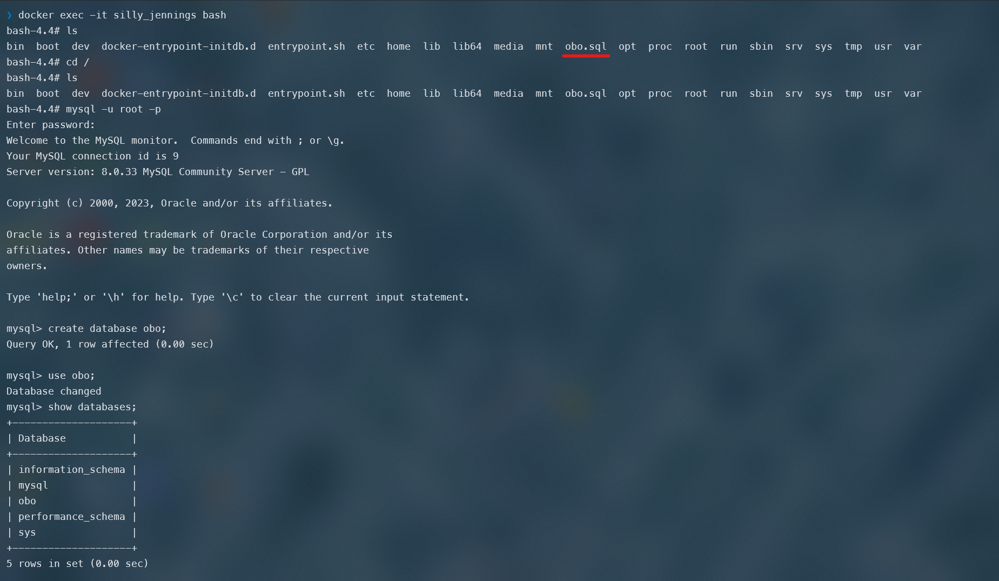
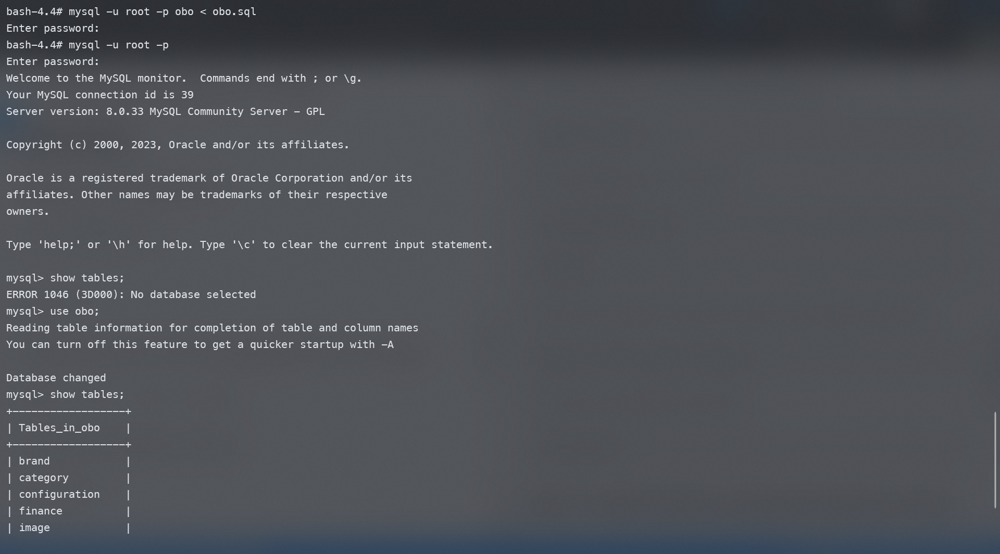
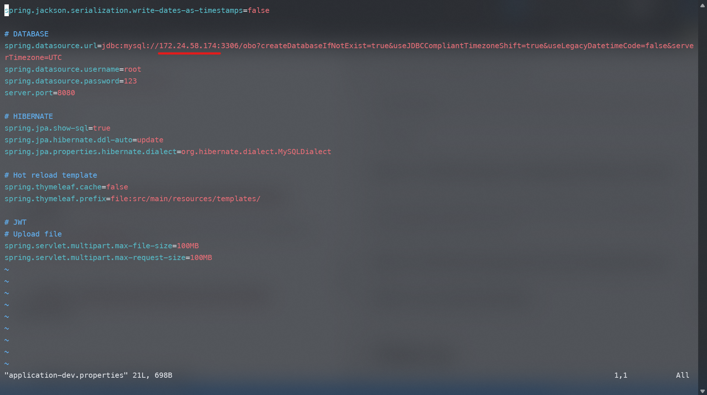

# Giới thiệu

  

bài lab tổng hợp với thao tác build và deploy một ưng dụng Java Maven lên môi trường Kubernetes

  

project demo được lấy tại github: https://github.com/liamhubian/techmaster-obo-web

  

# Mục tiêu bài lab

  

# Chuẩn bị

  

Để hoàn thành bài lab, người học cần chuẩn bị:

  

- Cài đặt kubectl trên client

- Cluster Kubernetes đang hoạt động và người học có khả năng kết nối tới cluster này

- Có thể sử dụng các công cụ như minikube, docker-desktop kubernetes, KinD,... trên môi trường lab

- thực hiện cấu hình alias trên terminal bằng command "alias k=kubectl"

  

# Các bước thực hiện

  

### Bước 0: (optional) chuẩn bị Cluster

  

> **Note**

>

> - Học viên chuẩn bị môi trường Kubernetes cho bài lab

> - Với học viên sử dụng KinD, hãy tận dụng file kind.conf được chuẩn bị sẵn cho bài lab

Tạo kind cluster từ file kind.conf có sẵn: 
```
kind create cluster --name obo-web --config kind.conf
```

### Bước 1: triển khai cơ sở dữ liệu MySQL
Triển khai cơ sở dữ liệu MySQL lên trên một worker node

Tạo một container từ image mysql, mapping port 3306 và set password cho user root là password
```
❯ docker run -d -p 3306:3306 -e MYSQL_ROOT_PASSWORD=password mysql
```
Copy file sql được tạo từ trước vào thư mục / trong container 
```
❯ docker cp obo.sql 'container-name':/
```

 Truy cập vào container để kiểm tra
 ```
❯ docker exec -it 'container-name' bash 
```



Sau đó đăng nhập vào mysql với password đã tạo 
```
mysql -u root -p
```
Tạo một database mới có tên obo
```
create database obo;
```
```
use obo;
```
Quay trở lại container, import file obo.sql vào database obo đã tạo
```
mysql -u root -p obo < obo.sql
```
Truy cập vào mysql kiểm tra kết quả
```
show tables;
```




### Bước 2: cài đặt ứng dụng và đóng gói dưới dạng container
Chỉnh sửa file /techmaster-obo-web/src/main/resources/application-dev.properties thành ip của host



Build image từ Dockerfile tại thư mục hiện tại
```
❯ docker build . -t phanhieu0825/obo-web:1.0
```
Image sau khi tạo xong sẽ được push lên dockerhub
```
❯ docker push phanhieu0825/obo-web:1.0
```
Chạy image đã tạo và mapping ra port 8081
```
❯ docker run -p 8081:8080 phanhieu0825/obo-web:1.0
```


### Bước 3: triển khai ứng dụng trên môi trường Kubernetes
Tạo config cho deployment obo-web sử dụng image đã tạo ở trên, lưu vào file templates/obo-web-deploy.yaml
```
k create deploy obo-web --image phanhieu0825/obo-web:1.0 --dry-run=client -o yaml > templates/obo-web-deploy.yaml
```
Kiểm tra cấu hình deployment đã tạo
```
❯ cat templates/obo-web-deploy.yaml
apiVersion: apps/v1
kind: Deployment
metadata:
  creationTimestamp: null
  labels:
    app: obo-web
  name: obo-web
spec:
  replicas: 1
  selector:
    matchLabels:
      app: obo-web
  strategy: {}
  template:
    metadata:
      creationTimestamp: null
      labels:
        app: obo-web
    spec:
      containers:
      - image: phanhieu0825/obo-web:1.0
        name: obo-web
        resources: {}
status: {}
```
Tạo deployment
```
❯ k create -f templates/obo-web-deployment.yaml
```

### Bước 4: truy cập tới ứng dụng
Sau khi deployment và pod đã ở trạng thái running, forward port ra ngoài tại port 8081
```bash
❯ k port-forward deploy/obo-web --address 0.0.0.0 8081:8080
```
Truy cập vào địa chỉ localhost:8081


# Clean up

  

Sau khi hoàn thành bài lab, học viên thực hiện xóa các tài nguyên

  

```bash

k  delete  -f  template/

```

> **Note**

>

> Học viên tạo portforward tới WSL2 thực hiện xóa proxy rule

> ```command

> netsh interface portproxy delete v4tov4 listenport=8080 listenaddress=0.0.0.0

> ```